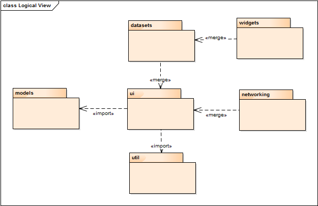
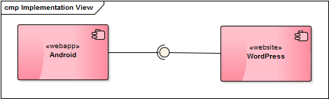
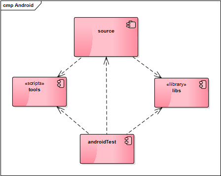
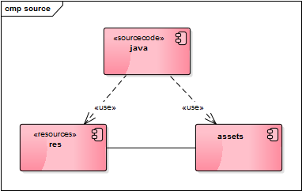
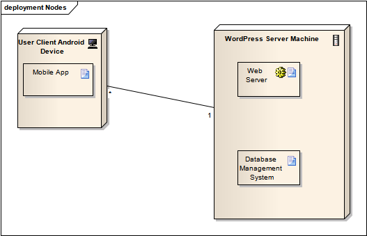
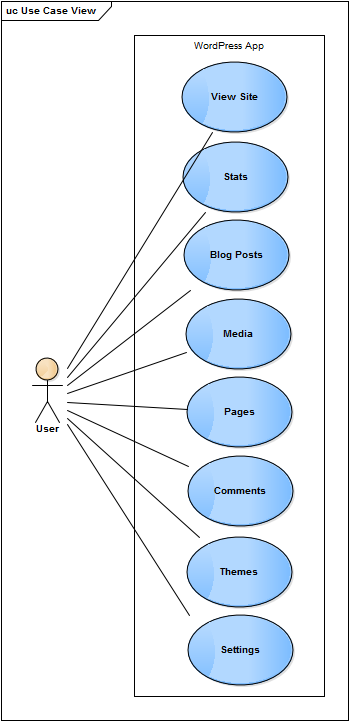

# Relatório 3 - ESOF #
## Arquitetura de Software ##

### Vista Lógica

  Este diagrama representa a Vista Lógica, traduzindo-se num UML de packages. Foram considerados seis packages: datasets, widgets, models, ui, networking e util. 
  
  Para elaborar o diagrama recorreu-se ao software Enterprise Architect, que através de reverse engineering, obtivemos vários outros diagramas que foram estudados e observados de modo a simplificar e perceber melhor como o projeto está organizado. Por outro lado, examinamos de um modo superficial todos os ficheiros de cada package para tentar decifrar as suas ligações e conceitos. Desta forma, a package datasets
  
	Relativamente ao diagrama em si, existem dois tipos de ligações: “import” e “merge”. A ligação “import” significa que um determinado package importa elementos de outro package, já a ligação “merge”, significa que importa não só elementos do package como os packages por ele importados.
	
	Por observação ao diagrama resultante verifica-se que todos os packages têm uma relação próxima visto que todos acrescentam funcionalidades uns aos outros.

### Vista de Implementação

Diagrama de componentes mostra a vista de implementação referente ao projeto WordPress:

#### Descrição

#### Descrição

#### Descrição

### Vista de Processo 

### Vista de Deployment 

Um diagrama de deployment permite mostrar de que modo os artefactos de um sistema são distribuídos em nós de hardware. Diagrama de deployment mostra a vista de deployment referente ao projeto WordPress para Android:

#### Descrição
Os nós são recursos de computação físicos com memória de processamento e serviços para executar software, neste caso telemóveis cujo sistema operativo seja Android (primeiro nó) e um segundo nó em que está representado o database server. 
Cada artefacto corresponde a um componente de software, neste caso, distribuído em ambos os nós de hardware como a aplicação móvel que corre no dispositivo Android e a base de dados bem como o sistema de manuseamento da mesma que está incorporado na base de dados.

### Use Case View (+1) 

Este diagrama representa a possível interação do utilizador para com a aplicação, isto é, quem tiver a aplicação poderá visitar o site e consultar estatísticas, ver publicações, fotografias e vídeos, páginas relacionadas e os comentários às mesmas e, por fim, alterar o tema assim como mais configurações.

### Conclusão e Análise
É importante referir que todos os diagramas ao longo do relatório foram elaborados pelos elementos do grupo, sendo que não houve nenhum tipo de verificação ou ajuda por parte dos colaborados do projecto WordPress por falta de disponibilidade dos mesmo.

De uma forma geral, acreditamos que a aplicação bem como o projeto na sua generalidade está bem desenhada e organizada do ponto de vista arquitetural. Assim sendo, o trabalho em termos de elaboração dos diagramas teria sido mais complexo se assim não fosse, pois apesar de ser relativamente fácil de contribuir para o projeto, os standards em termos de a organização e coerência são mantidos intactos. 

## Autores

* Fábio Amarante
* Luís Gonçalves
* Ricardo Lopes
