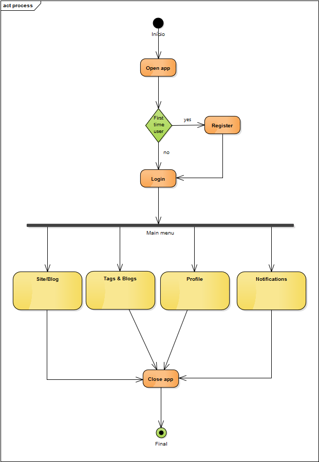

# Relatório 3 - ESOF #
## Arquitetura de Software ##
### Introdução
O presente relatório serve para apresentar os aspectos mais relevantes da arquitetura de software do projecto WordPress-Android, de acordo com o modelo de vistas 4+1. Este modelo foi projetado por Philippe Kruchten, em 1995, com o objetivo de "descrever a arquitetura de sistemas de software, utilizando múltiplos pontos de vista simultâneos". Estes pontos de vista são os seguintes:

* __Vista Lógica__ - Mostra as principais abstrações-chave no sistema como objetos ou classes de objetos, ou os seu packages. Representado tipicamente por diagrama UML de packages.
* __Vista de Deployment__ - Mostra o hardware do sistema e como os componentes do software estão distribuídos pelos nós de hardware. Normalmente representado por diagrama UML de deployment.
* __Vista de Processo__ - Mostra, em tempo de execução, como os processos do sistema interagem. Os diagramas de atividade são os mais utilizados para representar isto.
* __Vista de Implementação__ - Mostra como o software é decomposto para o desenvolvimento. Normalmente representado por diagrama UML de componentes.
* __Vista de Casos de Uso (+1)__ - Combinando as diferentes vistas faz com que esta vista que se consegue entender as interações entre os diversos componentes do sistema. Representado por um diagrama UML de casos de uso.

### Vista Lógica
Este diagrama representa a Vista Lógica, traduzindo-se num UML de packages. Foram considerados seis packages: datasets, widgets, models, ui, networking e util. 

 
#### Descrição
Para elaborar o diagrama recorreu-se ao software Enterprise Architect, que através de reverse engineering, obtivemos vários outros diagramas que foram estudados e observados de modo a simplificar e perceber melhor como o projeto está organizado. Por outro lado, examinamos de um modo mais aprofundado todos os ficheiros de cada package para tentar decifrar as suas ligações e conceitos. Assim:

* __datasets__ - tal como o nome diz, está relacionada com coleções de dados tabulares;
* __widgets__ - contém diferentes componentes e vistas relacionadas com a interface gráfica;
* __models__- trata de determinados modelos estruturais da aplicação como dados e ações do utilizador;
* __ui__ - está relacionado com a interface do utilizador;
* __networking__ - abrange as comunicações utilizador/servidor assim como certificados relacionados;
* __util__ - contém diversas ferramentas que auxiliam os restantes packages.

Relativamente ao diagrama em si, existem dois tipos de ligações: *import* e *merge*. A ligação *import* significa que um determinado package importa elementos de outro package, já a ligação *merge*, significa que importa não só elementos do package como os packages por ele importados.

Por observação ao diagrama resultante verifica-se que todos os packages têm uma relação próxima visto que muitos acrescentam funcionalidades uns aos outros.

### Vista de Implementação

Diagrama de componentes mostra a vista de implementação referente ao projeto WordPress:

#### Descrição
De acordo com a nossa interpretação, a O WordPress pode ser dividido em dois componentes essenciais. Sendo o primeiro componente incorpora as funcionalidades da biblioteca WordPress (Website) e o segundo o sistema operativo Android e as suas funcionalidades.

#### Descrição

#### Descrição

### Vista de Processo 
No seguinte diagrama de atividades, são demonstrados os processos dinâmicos da aplicação WordPress para Android 

#### Descrição
Acreditamos que a vista demonstrada é uma boa representação das funcionalidades da Aplicação sendo que são bastante intuitivas não sendo necessária uma analise detalhada. No entanto é de realçar que existem inúmeras outras funcionalidades da aplicação que tornariam a vista bastante mais expandida especialmente em termos de definições da aplicação bem como possibilidade de integrar outras funcionalidades externas como opções de partilha em redes sociais e outras aplicações.  

### Vista de Deployment 

Um diagrama de deployment permite mostrar de que modo os artefactos de um sistema são distribuídos em nós de hardware. Diagrama de deployment mostra a vista de deployment referente ao projeto WordPress para Android:

#### Descrição
Os nós são recursos de computação físicos com memória de processamento e serviços para executar software, neste caso telemóveis cujo sistema operativo seja Android (nó mais à esquerda) e um segundo nó em que está representado o database server machine. 
Cada artefacto corresponde a um componente de software, neste caso, distribuído em ambos os nós de hardware como a aplicação móvel que corre no dispositivo Android e a base de dados bem como o sistema de manuseamento da mesma que está incorporado na base de dados. Existe uma clara distinção entre os dois nós de hardware, o cliente e o servidor, bem como aos artefactos que neles são distribuídos.

### Use Case View (+1) 

Este diagrama representa a possível interação do utilizador para com a aplicação.

#### Descrição
Um utilizador depois de instalada a aplicação poderá visitar o site e consultar estatísticas, ver publicações, fotografias e vídeos, páginas relacionadas e os comentários às mesmas, bem como alterar o tema assim como mais configurações. A aplicação possui várias funcionalidades sendo que seria possível expandir o gráfico mas achamos que ficaria desnecessariamente grande e os acrescimos seriam pouco relevantes.

### Conclusão e Análise
É importante referir que todos os diagramas ao longo do relatório foram elaborados pelos elementos do grupo, sendo que não houve nenhum tipo de verificação ou ajuda por parte dos colaborados do projecto WordPress por falta de disponibilidade dos mesmo.

De uma forma geral, acreditamos que a aplicação bem como o projeto na sua generalidade está bem desenhada e organizada do ponto de vista arquitetural. Assim sendo, o trabalho em termos de elaboração dos diagramas teria sido mais complexo se assim não fosse, pois apesar de ser relativamente fácil de contribuir para o projeto, os standards em termos de a organização e coerência são mantidos intactos. 

## Autores

* Fábio Amarante
* Luís Gonçalves
* Ricardo Lopes

## Contribuição

Relativamente à contribuição de cada elemento para a realização deste relatório, o grupo considera que o trabalho foi igualmente dividido pelos três elementos.
