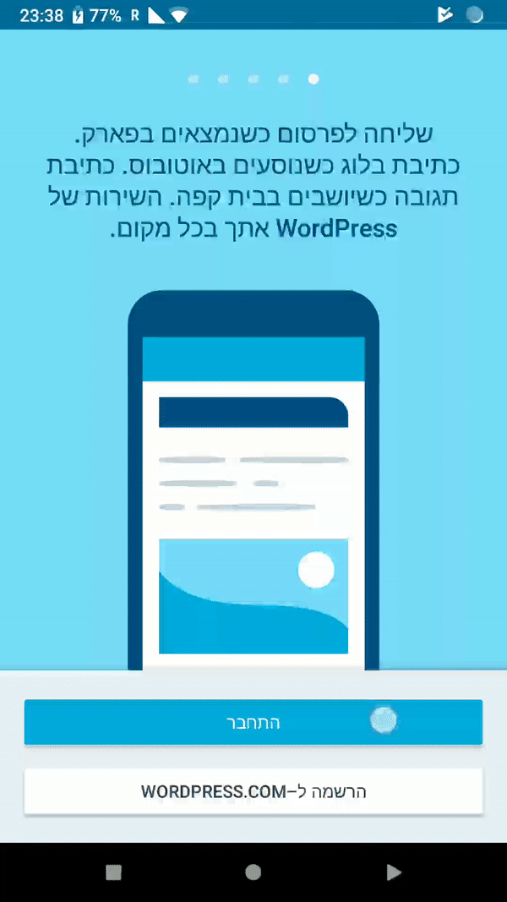
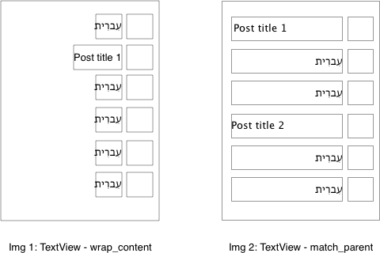

# Right to Left Layout Guidelines

Supporting Right-to-left written scripts is quite straightforward as most issues are handled automatically by the OS or are guarded by lint.


### Animations and Drawables
Whenever you add a new animation/drawable, consider whether it needs to be mirrored in RtL mode (Use `ldrtl` drawable selector - example `drawable-ldrtl-v18`).

LTR | RTL
--------|-------
        |       

### Images/Icons
Writing direction also affects time flow direction -> some asymmetric images/icons, such as `reply` or `back`, need to be mirrored.

### Text alignment
OS automatically mirrors layouts in RtL mode. In rare cases the default text alignment (which is derived from the text language) needs to be overridden to keep the UI look consistent.

Example: List of posts can contain posts in both English and Hebrew. When the title TextField width is set to wrap_content, everything is handled correctly (see img 1). But if the title TextField width is set to match_parent, the UI can become disarranged (see img 2 -> to fix the issue set the text alignment explicitly to viewStart -> ```android:textAlignment="viewStart"```).




