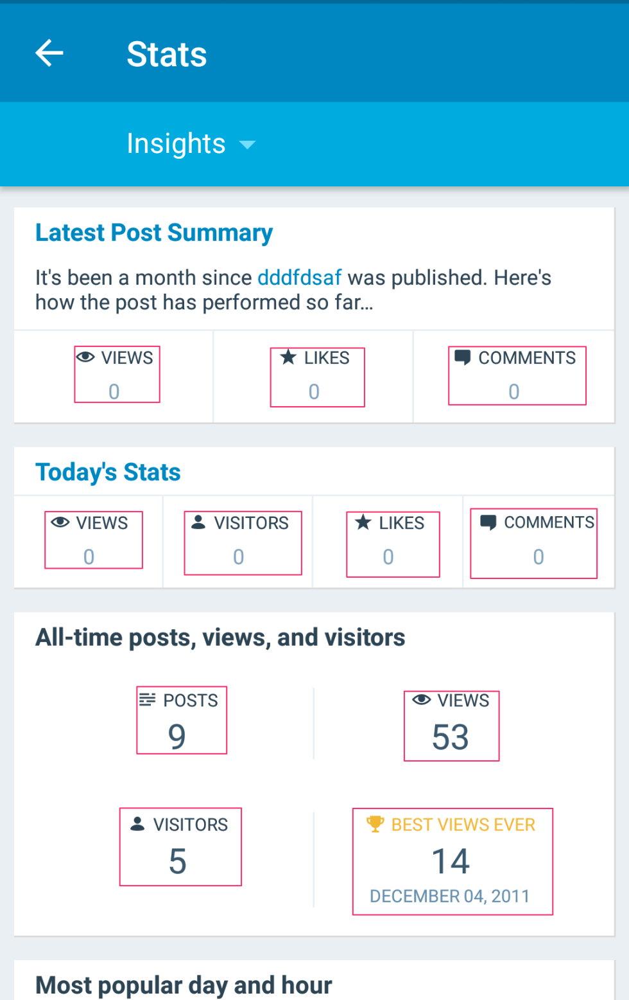

# TalkBack Guidelines

“Making applications accessible not only ensures equal access to the roughly 1 billion people in the world with disabilities but also benefits people without disabilities by allowing them to customize their experiences.” - [Google Accessibility](https://www.google.com/accessibility/for-developers/)

### Table of Contents 

- [Governing Principles](#governing-principles)
- [Getting Started](#getting-started)
- [Guidelines](#guidelines)
   - [Basics](#basics)
	- [Grouping Content](#grouping-content)
	- [Spoken Order](#spoken-order)
	- [Appearing and Disappearing Elements](#appearing-disappearing)
	- [Custom Views](#custom-views)
- [Auditing](#auditing)
- [FAQ](#faq)
- [Further Reading](#further-reading)

## <a name="governing-principles"></a>Governing Accessibility Principles 
* Make the information on the screen as visible as possible. 
* Always design the size of controls and touch areas inclusive of all use cases.
* Provide as much support context and details for all views & actions. Images, buttons, lists and the actions they enable should have thorough, well-formatted descriptions that allow the accessibility APIs to deliver their intent seamlessly. 

	For more details visit [Make apps more accessible
](https://developer.android.com/guide/topics/ui/accessibility/apps.html).
	
## <a name="getting-started"></a>Getting Started

If you have never worked with TalkBack you can visit the TalkBack resources to get started.

- [Using TalkBack](using-talback.md)

## <a name="guidelines"></a>Guidelines

### <a name="basics"></a>Basics

The accessibility framework within Android has several ways in which you can provide cues to TalkBack, so it knows how it make it's announcement when a view becomes focused. 

* `contentDescription`  - Each view has this attribute that allows you to set meaningful and descriptive labels. If this is missing TalkBack might not be able to provide much value to the user. 
* `importantForAccessibility` - In cases where a view or layout might not have a need to be accessible this attribute can be set. It basically allows TalkBack to ignore views that have this property set to `yes` thus eliminating the need for a content description. 
* `hint` - For usability purposes, the text input control `EditText` has the hint attribute. If another view is providing the label then you can utilize the `labelFor` attribute. Below is an example.  

 ```
 <LinearLayout
    android:layout_width="match_parent"
    android:layout_height="match_parent"
    android:orientation="vertical">
    <TextView
        android:layout_width="match_parent"
        android:layout_height="wrap_content"
        android:text="@string/email_subject_label"
        android:labelFor="@id/email_subject" />
    <EditText
        android:id="@+id/email_subject"
        android:layout_width="wrap_content"
        android:layout_height="wrap_content" />
</LinearLayout>
```


#### Labels / Content Description 
To make a view ready for accessibility these are the rules that should govern the content descriptions that are set. 

* Do not include the type of the control. TalkBack will automatically announce the description you have set and the type. 
* Ensure that each description is unique. This ensures that TalkBack is able to communicate different views of the same type to the user without causing any confusion. This is especially useful in list controls such as `ListView` or `RecyclerView` where a view template is being used for each row with similar controls. In such cases, each row should have unique content descriptions. 
* Like all strings, content descriptions should be localized for maximum support in all languages. 


#### Activity titles
When an Activity comes to the foreground, TalkBack announces it’s title. When the activity has no title, TalkBack announces the name of the application which might confuse the user -> **_set a title to all visible activities_**, either in `AndroidManifest` or using `Activity.setTitle()` method.

#### Images
Set `contentDescription` attribute to all ImageViews (null is a valid value).

Illustrative images and images with labels should have contentDescription set to null -> “`android:contentDescription="@null`" or have `importantForAccessibility` set to “no” -> “`android:importantForAccessibility="no"`.


ImageButtons with labels should have contentDescription set to null. Setting importanceForAccessibility to “no” makes them unfocusable in the accessibility mode.


#### Touch Targets
Sometimes people have difficulty when attempting to select views with small touch targets on the  screen. 
Be sure to check for insufficient touch targets using the tools available. You can utilize the layout bounds functionality in Developer Options to see the current touch target size. 
Enable developer options by going to Settings > System > Developer Options. Under the Drawing section, selected "Show layout bounds" and turn it on. Your screen should now show the bounds & margins of every visible view on the screen. For touch targets : 
 
 * Each element that’s touch enabled should have at least 48dp x 48dp in size. 
 * Easiest way to increase this is to utilize the `padding` attribute. 
 * For views where you don’t want to modify the padding you can utilize the [TouchDelegate](https://developer.android.com/reference/android/view/TouchDelegate) functionality where you are able to get the current “Hit Rect) which is a rect with the current bounds and you are able to modify it to increase the touch area. There is a [function within ViewUtils](https://github.com/wordpress-mobile/WordPress-Android/blob/3f99349887f004a697f6ff6ec4a5d49bd1d9d497/WordPress/src/main/java/org/wordpress/android/util/ViewUtils.kt#L20) that does this well. 

### <a name="grouping-content"></a>Grouping content
If users should treat a set of elements as a single unit of information, you can group these elements in a focusable container using `android:focusable=”true”` or `android:screenReaderFocusable` attribute to `true` in API 28 and above.  



In cases like these, it's important that the descriptions of the elements are kept short since they all will be announced in a single utterance. 

### <a name="spoken-order"></a>Traversal/Spoken Order

The reading order of the views are determined by the order in which XML elements are declared. There might be times when this order doesn't translate to a natural sounding utterance by TalkBack so the order can be modified using these two attributes. 

* `accessibilityTraversalAfter`: takes the id of a view after which this one is visited in accessibility traversal
* `accessibilityTraversalBefore`: takes the id of a view before which this one is visited in accessibility traversal process.
* These can be set programmatically using `setAccessibilityTraversalBefore` and `setAccessibilityTraversalAfter`
* Note : These attributes are only available in API 22 and above. To utilize it in lower versions, `ViewCompat` can be leveraged (only enables the functionality if API 22 and above).

	 ```
	ViewCompat.setAccessibilityDelegate(imageView2, object : AccessibilityDelegateCompat() {
	    override fun onInitializeAccessibilityNodeInfo(host: View?, info: AccessibilityNodeInfoCompat?) {
	        info?.setTraversalAfter(imageView3)
	        super.onInitializeAccessibilityNodeInfo(host, info) }})
	
	
	
### <a name="custom-views"></a>Custom Views & Behavior

#### Announcements
If the Android framework is announcing something that needs more customization or a state change in the app needs to be made known to the user, the `announceForAccessibility` method of the `view` can be utilized to specify this message. By default the framework handles creating announcements for various events and state changes really well once the correct semantics are supplied. so this should only be utilized when necessary.

#### Actions & Events
For full accessibility support within custom views, you have to hook the accessibility events within different the different actions and events that are occurring within that view. For full backward compatibility `ViewCompat.setAccessibilityDelegate()` can be utilized. 
An example of this is the Usage hint / View action. When TalkBack is making an announcement for an actionable control it normally says "Tap to activate". There might be times when this needs to be customized and this can be done via the `AccessibilityDelegate` like so : 

```
	@Override
	public void onInitializeAccessibilityNodeInfo(View host, AccessibilityNodeInfoCompat info) {
	    super.onInitializeAccessibilityNodeInfo(host, info);
	
	    info.addAction(new AccessibilityActionCompat(ACTION_CLICK, "start playback"));
	}
```
So now the announcement will be "Tap to start playback".

#### Inaccessible Custom Views 

There might be times when a custom view such as a chart might not be accessible in no shape or form. This is how the `ExploreByTouchHelper` comes into play. This component allows virtual accessibility views to be created that intercepts touch events to trigger TalkBack announcements. It does this by hooking into a view once it has been drawn and creates virtual views using the `Rect` of the actual views. Since it's simply a super `AccessibilityDelegate` these views can be customized with `contentDescriptions` and `actions` when they become focused. 

### <a name="appearing-disappearing"></a>Appearing and Disappearing Elements

There are several views and UI patterns that involve views that appear for a limited to show something to the user. The most common ones are `Toasts` and `Snackbars`. These components already have accessibility support built in. However, the `SnackBar` behavior has to be extended to be more accessible. 
In this codebase, the `WPSnackBar` component has functionality that detects if the accessibility services are enabled and extends the time that the `SnackBar` is visible. This allows the user to interact with the actions that are present on the `SnackBar` before it disappears. Another component that is worth mentioning is the play/pause controls on a media component. Normally, they disappear and the user would tap the screen for them to reappear but in the case of TalkBack usage it would be best to make them remain on the screen permanently. The guiding principles for views of this nature are: 

* Ensure that the views that are appearing for a limited time, are either extended or have an indefinite time. 
* The actions that are present on these views should be available in other areas of the app, so that if the view disappears the user still has means of triggering the functionality elsewhere. 
* If a custom view is being created, ensure that the the description and actions are announced when an event occurs, and be mindful of the associated type being utilized. You can customize the behavior of a custom view to have a type similar to that of another built in/standard view if it shares similar characteristics with the one you created. This code snippet was taken from the Aztec Editor

	``` 
	fun ToggleButton.convertToButtonAccessibilityProperties() {
	    ViewCompat.setAccessibilityDelegate(this, object : AccessibilityDelegateCompat() {
	        override fun onInitializeAccessibilityNodeInfo(host: View?, info: AccessibilityNodeInfoCompat?) {
	            super.onInitializeAccessibilityNodeInfo(host, info)
	            info?.className = Button::class.java.name
	            info?.isCheckable = false
	            info?.addAction(AccessibilityNodeInfoCompat.AccessibilityActionCompat(ACTION_CLICK, context.getString(R.string.accessibility_action_click_label)))
	        }
	    })
	}
	```

So in this case the `ToggleButton` which normally gets announced as a `Switch` is now being announced as a `Button` and it's no longer `checkable` so the announcement doesn't say `Tap to toggle` it says `Tap to activate`. 

## <a name="auditing"></a>Auditing & Testing
#### Manual testing
 Interact with your app using Android accessibility services.
You are able to test the app using TalkBack or Voice Access. TalkBack allows you to interact with the app utilizing it’s screen reading functionality where selecting or swiping over elements reads out their descriptions and actions. Utilizing this creates the experience a visually impaired person would have while using the app. Voice Access allows a user to control the device using voice/spoken commands. This is really useful for persons who are motor impaired or may be in a situation where their hands can’t be used. 

Testing with analysis tools

Use tools to discover opportunities to improve your app's accessibility.

* Accessibility Scanner - Utilizing the Accessibility Test Framework it scans your screen and provides ways in which your accessibility can be improved by making changes to your labels, clickable items and other behaviour. 
* Google Play pre launch report - When you upload the app for distribution Google Play generates a report utilizing the Accessibility Test Framework that can be used to identify improvements that can be made. 
* UI Automator Viewer - Can scan the views of an app that’s running on a device and provide means by which the layout hierarchy can be analyzed at a deeper level. This is especially useful if other manual tests are being carried out and it reveals views that aren’t being focused or made accessible to the framework and a specific layout related change may need to be done to resolve the issue. 
* Lint - lint warnings are shown in the build phase for various accessibility issues that may arise. These lint warnings can even be enforced to break the build so developers are forced to implement accessibility related attributes.

#### Automated testing
* Power unit and integration tests using the Accessibility APIs with Espresso & Robolectric 
Espresso has an accessibility API that can allow you to run checks every time a ViewAction is performed. eg.`AccessibilityChecks.enable()`

* Furthermore, you are able to customize how it does traversal and verification if it’s generating false positives by utilizing the AccessibilityValidator’s  setSuppressingResultMatcher.There’s an AccessibilityUtil class in Robolectric that allows you to perform similar actions as described above for Espresso. 

#### User testing
Get feedback from real people who interact with your app.
Ask other coworkers to simulate the behavior that the impaired so they can test from the viewpoint of the target user while being able to prove clear insights based on their engineering background.
Reaching out to local communities that have people with disabilities who would be willing to help with testing. 
Contracting a user testing service that has testers who are disabled and are able to provide deep insights based on their expertise in providing this type of service. 

## <a name="faq"></a>F.A.Q
* A modal dialog was just shown, should the app announce the options?

	Yes,it could announce that there are options or the framework might treat it as a popup window so the user would know that actions exist. 

* I entered a search query and the search results were refreshed, should the app announce that?

	Yes, because search result’s state is being changed so there search results that will make the screen empty and some that will have contents so being able to make the user aware of the amount of results returned will determine their followup action.

* A snackbar/notice was just shown, should that have been announced?

	Yes, the existence of the snackbar alone means that the information being shown is important so all users must be made aware of it. 
	
* Should an icon be dictated even if I could not interact with it anyway?

	No, because that means it doesn’t provide any context to the user and can be categorized as decorative. 
I’m hovering on an image, what information should be dictated?
It depends on the context. For a static image it could describe what’s being shown and for a dynamic image placeholder it could describe what the image should represent or communicate. 


