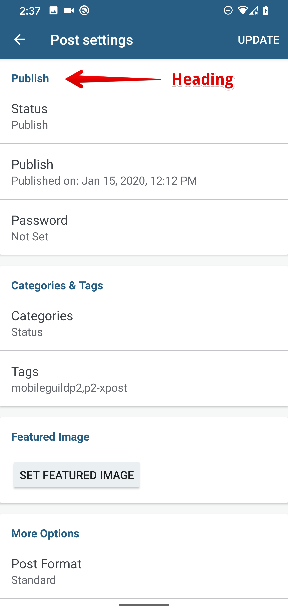

# TalkBack Guidelines

### Table of Contents 

- [Getting Started](#getting-started)
- [Guidelines](#guidelines)
   - [Basics](#basics)
	- [Grouping Content](#grouping-content)
	- [Live Regions](#live-regions)
	- [Spoken Order](#spoken-order)
	- [Focusing Views](#focusing-views)
	- [Horizontal Scrolling](#horizontal-scrolling)
	- [Appearing and Disappearing Elements](#appearing-disappearing)
	- [Custom Views](#custom-views)
- [Auditing](#auditing)
  - [Questions to ask](#questions)
  - [Manual Audit](#manual_auditing)
  - [Automated Audit](#automated_auditing)
  - [User Audit](#user_auditing)
- [Further Reading](#further-reading)
	
## <a name="getting-started"></a>Getting Started
“Making applications accessible not only ensures equal access to the roughly 1 billion people in the world with disabilities but also benefits people without disabilities by allowing them to customize their experiences.” - [Google Accessibility](https://www.google.com/accessibility/for-developers/)

#### Governing Accessibility Principles 

* Make the information on the screen as visible as possible. 
* Always design the size of controls and touch areas inclusive of all use cases.
* Provide as much support context and details for all views & actions. Images, buttons, lists and the actions they enable should have thorough, well-formatted descriptions that allow the accessibility APIs to deliver their intent seamlessly. 

	For more details visit [Make apps more accessible
](https://developer.android.com/guide/topics/ui/accessibility/apps.html).

#### TalkBack
This document will provide all the resources needed to improve an app's accessibility using TalkBack. If you have never worked with TalkBack you can visit the "Using TalkBack" document to get started.

- [Using TalkBack](using-talkback.md)

## <a name="guidelines"></a>Guidelines

### <a name="basics"></a>Basics

The accessibility framework within Android has several ways in which you can provide cues to TalkBack, so it knows how it makes it's announcement when a view becomes focused. 

* [`contentDescription`](https://developer.android.com/reference/android/view/View#attr_android:contentDescription)  - Each view has this attribute that allows you to set meaningful and descriptive labels. If this is missing TalkBack might not be able to provide much value to the user. 
* [`importantForAccessibility`](https://developer.android.com/reference/android/view/View#attr_android:importantForAccessibility) - In cases where a view or layout might not need to be accessible, this attribute can be set. It allows TalkBack to ignore views that have this property set to `yes`, thus eliminating the need for a content description. 
* [`hint`](https://developer.android.com/reference/android/widget/TextView#attr_android:hint) - For usability purposes, the text input control `TextView` has the hint attribute. If another view is providing the label, then you can utilize the [`labelFor`](http://developer.android.com/reference/android/view/View.html#setLabelFor(int)) attribute. Below is an example.  

 ```xml
 <LinearLayout
    android:layout_width="match_parent"
    android:layout_height="match_parent"
    android:orientation="vertical">
    <TextView
        android:layout_width="match_parent"
        android:layout_height="wrap_content"
        android:text="@string/email_subject_label"
        android:labelFor="@id/email_subject" />
    <EditText
        android:id="@+id/email_subject"
        android:layout_width="wrap_content"
        android:layout_height="wrap_content" />
</LinearLayout>
```

#### Labels / Content Description 
To make a view ready for accessibility these are the rules that should govern the content descriptions that are set. 

* Do not include the type of the control. TalkBack will automatically announce the description you have set and the type. 
* Ensure that each description is unique. This ensures that TalkBack can communicate different views of the same type to the user without causing any confusion. This is especially useful in list controls such as `ListView` or `RecyclerView` where a view template is being used for each row with similar controls. In such cases, each row should have unique content descriptions. 
* Like all strings, content descriptions should be localized for maximum support in all languages. 

#### Activity titles
When an Activity comes to the foreground, TalkBack announces it’s title. When the activity has no title, TalkBack announces the name of the application, which might confuse the user → **_set a title to all visible activities_**, either in `AndroidManifest` or using `Activity.setTitle()` method.

#### Images
Set `contentDescription` attribute to all ImageViews (null is a valid value).

Illustrative images and images with labels should have contentDescription set to null → “`android:contentDescription="@null`" or have `importantForAccessibility` set to “no” → “`android:importantForAccessibility="no"`.


ImageButtons with labels should have contentDescription set to null. Setting importanceForAccessibility to “no” makes them unfocusable in the accessibility mode.


#### Headings

One of the many navigation modes provided by TalkBack is that of "Heading". This mode allows the user to jump to a different section of the screen utilizing the heading of that area. This functionality was introduced in Android Pie, and it can be enabled by putting the [`android:accessibilityHeading="true"`](https://developer.android.com/reference/android/view/View#attr_android:accessibilityHeading) on the element that needs to become a heading. If the min sdk is less than 28 then this can be enabled using the [`AccessibilityDelegate`](https://developer.android.com/reference/android/view/View.AccessibilityDelegate). 

```java
public static void enableAccessibilityHeading(@NonNull View view) {
        setAccessibilityDelegateSafely(view, new AccessibilityDelegateCompat() {
            @Override public void onInitializeAccessibilityNodeInfo(View host, AccessibilityNodeInfoCompat info) {
                super.onInitializeAccessibilityNodeInfo(host, info);
                info.setHeading(true);
            }
        });
    }
```

Below is an example of the heading functionality in action. 

This is one of the target headings.



This is how TalkBack behaves when you swipe left or right to navigate the headings.


#### Touch Targets
Sometimes people have difficulty when attempting to select views with small touch targets on the  screen. 
Be sure to check for insufficient touch targets using the tools available. You can utilize the layout bounds functionality in Developer Options to see the current touch target size. 
Enable developer options by going to Settings > System > Developer Options. Under the Drawing section, select "Show layout bounds" and turn it on. Your screen should now show the bounds & margins of every visible view on the screen. For touch targets : 
 
 * Each element that’s touch-enabled should have at least 48dp x 48dp in size. 
 * The easiest way to increase this is to utilize the `padding` attribute. 
 * For views where you don’t want to modify the padding, you can utilize the [TouchDelegate](https://developer.android.com/reference/android/view/TouchDelegate) functionality where you can get the current “Hit Rect), which is a rect with the current bounds, and you can modify it to increase the touch area. There is a [function within ViewUtils](https://github.com/wordpress-mobile/WordPress-Android/blob/3f99349887f004a697f6ff6ec4a5d49bd1d9d497/WordPress/src/main/java/org/wordpress/android/util/ViewUtils.kt#L20) that does this well. 

#### Color Contrasts

Users that have low vision might find it difficult to read the information on the screen when there isn't enough contrast between the foreground and the background. To solve this issue, it's usually best to utilize the [Contrast Checker](https://webaim.org/resources/contrastchecker/) that will allow you to compare a new foreground color with the current background to see if the ratio will make the improvement appropriate. Below is an example of how the contrast of the Aztec editor was improved. The steps to do this were as follows. 

* The foreground color of the view in question was located and it was determined that it was `<color name="wp_grey_dark">#2e4453</color>`
* Luckily for us, we have several other colors that are higher in contrast that can be utilized. 

	```xml
	<color name="wp_grey_dark">#2e4453</color>
	<color name="wp_grey_darken_10">#668eaa</color>
	<color name="wp_grey_darken_20">#4f748e</color>
	<color name="wp_grey_darken_30">#3d596d</color>
	```
* The `wp_grey_darken_10` was then checked with the Contrast Checker with the background color of white and the ratio was above the amount stipulated for low vision users. 

This was the end result : 

Before | After 
--------|-------
        | 

Even though the change is subtle, improving the color contrasts of our elements can go a far way for users with low vision. 
 
### <a name="grouping-content"></a>Grouping content
There are times when users should treat a set of elements as a single unit of information. You can group these elements in a focusable container using [`android:focusable=”true”`](https://developer.android.com/reference/android/view/View#attr_android:focusable) or [`android:screenReaderFocusable`](https://developer.android.com/reference/android/view/View#attr_android:screenReaderFocusable) attribute to `true` in API 28 and above.  


In cases like these, the descriptions of the elements must be kept short since they all will be announced in a single utterance. 

### <a name="live-regions"></a>Live regions (dynamic content)

To activate the functionality of views with TalkBack, you have to navigate to it. However, there are times when the contents of a view might change and the user should be made aware of it. This is where Live Regions come in. For example, say you have a `TextView` similar to the one defined below. 

```xml
<TextView
   android:id="@+id/feedback_text_view"
   android:layout_width="match_parent"
   android:layout_height="wrap_content"
   android:textColor="@color/white"
   android:padding="@dimen/standard_padding"
   android:textSize="@dimen/large_text" />
```

You can add a [live region attribute](https://developer.android.com/reference/android/view/View#attr_android:accessibilityLiveRegion) to it so that when `setText` is called TalkBack will announce it. 

```xml
<TextView
   android:id="@+id/feedback_text_view"
   android:layout_width="match_parent"
   android:layout_height="wrap_content"
   android:textColor="@color/white"
   android:padding="@dimen/standard_padding"
   android:textSize="@dimen/large_text" 
   android:accessibilityLiveRegion="polite"/>
```

The live region attribute is set to `polite` so that means it won't interrupt TalkBack if it is currently announcing something but if it is important that it gets announced it can be set to `assertive`. This should be used sparingly.

In addition to live region, another consideration, is to ensure that views that are being dynamically altered are having their content descriptions updated. A good example is a single button, that represents a "Play/Stop" behavior. Imagine the content description for this control in the "Play" state being "Allows you to start the Media Player" when the button actually says "Stop". 

### <a name="spoken-order"></a>Traversal/Spoken Order

The reading order of the views are determined by the order in which XML elements are declared. There might be times when this order doesn't translate to a natural-sounding utterance by TalkBack so the order can be modified using these two attributes. 

* [`accessibilityTraversalAfter`](https://developer.android.com/reference/android/view/View.html#attr_android:accessibilityTraversalAfter): takes the id of a view after which this one is visited in accessibility traversal
* [`accessibilityTraversalBefore`](https://developer.android.com/reference/android/view/View.html#attr_android:accessibilityTraversalBefore): takes the id of a view before which this one is visited in accessibility traversal process.
* These can be set programmatically using `setAccessibilityTraversalBefore` and `setAccessibilityTraversalAfter`
* Note: These attributes are only available in API 22 and above. To utilize it in lower versions, [`ViewCompat`](https://developer.android.com/reference/androidx/core/view/ViewCompat#setAccessibilityDelegate(android.view.View,%20androidx.core.view.AccessibilityDelegateCompat)) can be leveraged (only enables the functionality if API 22 and above).

	 ```java
	ViewCompat.setAccessibilityDelegate(imageView2, object : AccessibilityDelegateCompat() {
	    override fun onInitializeAccessibilityNodeInfo(host: View?, info: AccessibilityNodeInfoCompat?) {
	        info?.setTraversalAfter(imageView3)
	        super.onInitializeAccessibilityNodeInfo(host, info) }})

### <a name="focusing-views"></a>Focusing Views

Proper focusing of views is one of the most important parts of proper TalkBack navigation. 

#### Focus Navigation

In Android, focus is provided to views that require user interactions. Some examples are `EditText`, `Switch`, `CheckBox`. 

 Some views are focusable by default and others are made focusable by having `focusable` set to `true`. 

#### Accessibility Focus
TalkBack is able to gain focus an all meaningful views of the screen which includes views that are non-focusable such as `ImageView` or `TextView`.

To make a view focusable for accessible you can utilize : 
* `android:importantForAccessibility` 
*  In Android Pie and onwards,  `android:screenReaderFocusable`. 
*  You can also make the view focusable by utilizing `setFocusable(boolean focusable)` in the `AccessibilityNodeInfo` of an `AccessibilityDelegate`. 

#### Focus Guidelines
* It is important that you manage how focus is being set. Ensure you don't confuse keyboard focus/input focus with accessibility focus, as you can end up in a situation where you set `focusable` to true for accessibility reasons and it impacts the user experience for users using the app without TalkBack. 
* Do not attempt to force TalkBack to focus on a specific view, as it breaks predictable navigation and you might make the app more inaccessible. TalkBack also attaches itself late in the activity lifecyle so it might be difficult to get this to work properly without a hacky solution. 

### <a name="horizontal-scrolling"></a>Horizontal Scrolling

Horizontal scrolling views are common UI components in every developer's arsenal. In Android, we primarily utilize the `ViewPager` to create this experience. These views have to be optimized for TalkBack, since a visually impaired might find it difficult to know that it needs to be scrolled horizontally. To remedy this situation, visual indicators can be added so that TalkBack can scroll horizontally if necessary. This could be as simple as putting a Previous and Next button within the view or modifying the TalkBack announcement of the element, so that users know they can scroll for more content.


### <a name="custom-views"></a>Custom Views & Behavior

#### Custom Announcements
If the Android framework is announcing something that needs more customization or a state change in the app needs to be made known to the user, the [`announceForAccessibility`](https://developer.android.com/reference/android/view/View.html#announceForAccessibility(java.lang.CharSequence)) method of the `view` can be utilized to specify this message. By default, the framework handles creating announcements for various events, and state changes well once the correct semantics are supplied. So this should only be utilized when necessary.

#### Custom Events
For full accessibility support within custom views, you have to hook the accessibility events within the different actions and events that are occurring within that view. For full backward compatibility `ViewCompat.setAccessibilityDelegate()` can be utilized. 
An example of this is the Usage hint / View action. When TalkBack is announcing an actionable control, it normally says "Tap to activate". There might be times when this needs to be customized, and this can be done via the `AccessibilityDelegate` like so:
 

```java
	@Override
	public void onInitializeAccessibilityNodeInfo(View host, AccessibilityNodeInfoCompat info) {
	    super.onInitializeAccessibilityNodeInfo(host, info);
	
	    info.addAction(new AccessibilityActionCompat(ACTION_CLICK, "start playback"));
	}
```
So now the announcement will be "Tap to start playback".

#### Custom Actions

If you have a view that contains several actions, then it might be difficult for the user to activate them without any confusion. You can utilize a custom action dialog to show the options available in a more accessible & friendly format. This dialog won't replace the existing actions, as it's more for convenience to the user navigating the app via TalkBack.

To make the example a lot clearer, we will be focusing on optimizing the actions available on a post within the `Post List`. 


* To accomplish this, you would have to first detect if TalkBack is enabled. 

	```java
	AccessibilityManager am = (AccessibilityManager) getSystemService(ACCESSIBILITY_SERVICE);
	boolean isAccessibilityEnabled = am.isEnabled();
	```

* Once TalkBack is enabled then you can then add a `LongClickListener` that will open the dialog. 

* Since there are a lot of tutorials on creating dialogs, we will just be showing an image of how the post dialog could look. 

	
	
	Even though it's not the most visually appealing dialog, it doesn't need to be since it's for TalkBack. Navigating these actions is as easy as swiping left or right and making a selection. 
	
* Once the dialog has been implemented, you need to add custom accessibility actions. You can either override two methods on the `View` or set your own `AccessibilityDelegate`. Below are the two methods that are important for providing the accessibility framework with details about the actions and telling it what to do when an action is triggered using TalkBack. 
	(N.B The code below is for example purposes and doesn't reflect methods or behavior in the actual codebase)
 
	```java
	 @Override
    public void onInitializeAccessibilityNodeInfo(View host, AccessibilityNodeInfoCompat info) {
        super.onInitializeAccessibilityNodeInfo(host, info);
        info.addAction(new AccessibilityNodeInfoCompat.AccessibilityActionCompat(R.id.edit, "Edit"));
        info.addAction(new AccessibilityNodeInfoCompat.AccessibilityActionCompat(R.id.view, "View"));
        // ... for each action
    }

    @Override
    public boolean performAccessibilityAction(View host, int action, Bundle args) {
        switch (action) {
            case R.id.edit:
                postHandler.edit();
                return true;
            // ... other actions
            default:
                return super.performAccessibilityAction(host, action, args);
        }
     }
	}
	```
	
#### Inaccessible Custom Views 

There might be times when a custom view, such as a chart, might not be accessible in no shape or form. This is how the [`ExploreByTouchHelper`](https://developer.android.com/reference/android/support/v4/widget/ExploreByTouchHelper) comes into play. This component allows virtual accessibility views to be created that intercepts touch events to trigger TalkBack announcements. It does this by hooking into a view once it has been drawn and creates virtual views using the `Rect` of the actual views. Since it's a super `AccessibilityDelegate`, these views can be customized with `contentDescriptions` and `actions` when they become focused. 


### <a name="appearing-disappearing"></a>Appearing and Disappearing Elements

There are several views and UI patterns that involve views that appear for a limited to show something to the user. The most common ones are `Toasts` and `Snackbars`. These components already have accessibility support built-in. However, the `SnackBar` behavior has to be extended to be more accessible. 
In this codebase, the `WPSnackBar` component has functionality that detects if the accessibility services are enabled and extends the time that the `SnackBar` is visible. Eg. this Snackbar below is hidden after a few seconds, so in an accessibility mode, this wouldn't happen.


 This allows the user to interact with the actions that are present on the `SnackBar` before it disappears. Another component that is worth mentioning is the play/pause controls on a media component. Usually, they disappear and the user would tap the screen for them to reappear, but in the case of TalkBack usage, it would be best to make them remain on the display permanently. The guiding principles for views of this nature are: 

* Ensure that the views that are appearing for a limited time are either extended or have indefinite time. 
* The actions that are present on these views should be available in other areas of the app so that if the view disappears the user still has means of triggering the functionality elsewhere. 
* If a custom view is being created, ensure that the the description and actions are announced when it is displayed. Also be mindful of the associated type being utilized. You can customize the behavior of a custom view to have a type similar to that of another built-in/standard view if it shares similar characteristics with the one you created. This code snippet was taken from the Aztec Editor

	```kotlin
	fun ToggleButton.convertToButtonAccessibilityProperties() {
	    ViewCompat.setAccessibilityDelegate(this, object : AccessibilityDelegateCompat() {
	        override fun onInitializeAccessibilityNodeInfo(host: View?, info: AccessibilityNodeInfoCompat?) {
	            super.onInitializeAccessibilityNodeInfo(host, info)
	            info?.className = Button::class.java.name
	            info?.isCheckable = false
	            info?.addAction(AccessibilityNodeInfoCompat.AccessibilityActionCompat(ACTION_CLICK, context.getString(R.string.accessibility_action_click_label)))
	        }
	    })
	}
	```
So in this case the `ToggleButton` which normally gets announced as a `Switch` is now being announced as a `Button` and it's no longer `checkable` so the announcement doesn't say `Tap to toggle` it says `Tap to activate`. 

## <a name="auditing"></a>Auditing & Testing

There are several tools and approaches you can utilize to audit your app for TalkBack. 

### <a name="questions"></a>Questions to ask

When you are performing your audit, you can utilize these guiding questions to help:

* Is the navigation order of TalkBack what you are expecting? 
* Are there decorative elements on the screen that are gaining focus that should be inaccessible?
* Are there elements that should be accessible but they aren't? 
* Are there elements that belong to a group and are being focused individually?
* Is the content description, type and action of each element appropriate? Eg. `ToggleButton` that was behaving like a `Switch` but was being used like a `Button`.
* Are all the strings being used in the content descriptions and actions localized?
* Is the touch target of the view large enough for it to be easily selected?
* Do all elements have the appropriate contrast ratio for maximum visibility?
* Are there any state changes that aren't being announced?
* Does TalkBack function well with in app gestures such as swiping, zooming, and scrolling?

### <a name="manual_auditing"></a>Manual Audit

 Interact with your app using Android accessibility services.

You can test the app using TalkBack since it's simply an app that's built on top of the accessibility services. TalkBack allows you to interact with the app utilizing it’s screen reading functionality where selecting or swiping over elements reads out their descriptions and actions. Utilizing this creates the experience a visually impaired person would have while using the app.

* Once TalkBack is enabled, you can navigate to TalkBack Settings to optimize it's behavior, so that you can get as much diagnostics from your audit. One of the best options available is the enabling of captions. This allows TalkBack to display it's output at the bottom of the screen so you can validate what you are hearing. If necessary, you can also take screenshots that encapsulate TalkBack behavior when captions are enabled. 

* To enable captions, go to Accessibility → TalkBack → Settings → Miscellaneous → Developer settings and then enable "Display speech output" similar to the screenshot below. 

	

Testing with analysis tools

Use tools to discover opportunities to improve your app's accessibility.

* [Accessibility Scanner](https://support.google.com/accessibility/android/answer/6376570?hl=en) - Utilizing the Accessibility Test Framework it scans your screen and provides ways in which your accessibility can be improved by making changes to your labels, clickable items and other behaviour. The report normally focuses on touch targets, contrasts ratios, and repetitive content descriptions. 
* Google Play pre launch report - When you upload the app for distribution Google Play generates a report utilizing the Accessibility Test Framework that can be used to identify improvements that can be made. 
* [UI Automator Viewer](https://developer.android.com/training/testing/ui-automator) - Can scan the views of an app that’s running on a device and provide means by which the layout hierarchy can be analyzed at a deeper level. This is especially useful if other manual tests are being carried out, and it reveals views that aren’t being focused or made accessible to the framework, and a specific layout related change may need to be done to resolve the issue. 
* Lint - lint warnings are shown in the build phase for various accessibility issues that may arise. These lint warnings can even be enforced to break the build so developers are forced to implement accessibility-related attributes.

### <a name="automated_audit"></a>Automated Audit
* Power unit and integration tests using the Accessibility APIs with Espresso & Robolectric 
Espresso has an accessibility API that can allow you to run checks every time a ViewAction is performed. eg. [`AccessibilityChecks.enable()`](https://developer.android.com/training/testing/espresso/accessibility-checking)

* Furthermore, you can to customize how it does traversal and verification if it’s generating false positives by utilizing the AccessibilityValidator’s  setSuppressingResultMatcher.There’s an AccessibilityUtil class in Robolectric that allows you to perform similar actions as described above for Espresso. 

### <a name="user_audit"></a>User Audit
Get feedback from real people who interact with your app.
Ask other coworkers to simulate the behavior that the impaired so they can test from the viewpoint of the target user while being able to prove clear insights based on their engineering background.
Reaching out to local communities that have people with disabilities who would be willing to help with testing. 
Contracting a user testing service that has testers who are disabled and can provide deep insights based on their expertise in delivering this type of service. 


## <a name="further-reading"></a>Further Reading

* Google Links 
	* [Android Accessibility Documentation](https://developer.android.com/guide/topics/ui/accessibility/)
	* [Google Accessibility Code Lab](https://codelabs.developers.google.com/codelabs/basic-android-accessibility/)
* Talks
	*	 [Making Android Accessibility Easy (Android Dev Summit '18) - Youtube](https://www.youtube.com/watch?v=R2NftUX7rDM)
	* [What’s new in Android accessibility (Google I/O '18) - YouTube](https://www.youtube.com/watch?v=Lcoc4aCLfqI)
	* [What's New in Android Accessibility (Google I/O '17) - YouTube](https://www.youtube.com/watch?v=h5rRNXzy1xo)
	* [Demystifying Android Accessibility Development (Google I/O'19) - YouTube](https://www.youtube.com/watch?v=bTodlNvQGfY)
	* [Droidcon NYC 2015 - Android Accessibility 101 - YouTube](https://www.youtube.com/watch?v=UOr3mgqJU0A)
* Others
	* [Buffer - Announce Actions](https://overflow.buffer.com/2018/09/05/announce-actions/)
	* [Paciello Group - Mobile Accessibility Guidelines](https://developer.paciellogroup.com/blog/2017/11/mobile-accessibility-testing-guide-for-android-and-ios-free/)
	* [Orange -  Accessibility Guidelines](https://a11y-guidelines.orange.com/mobile_EN/dev-android.html)


