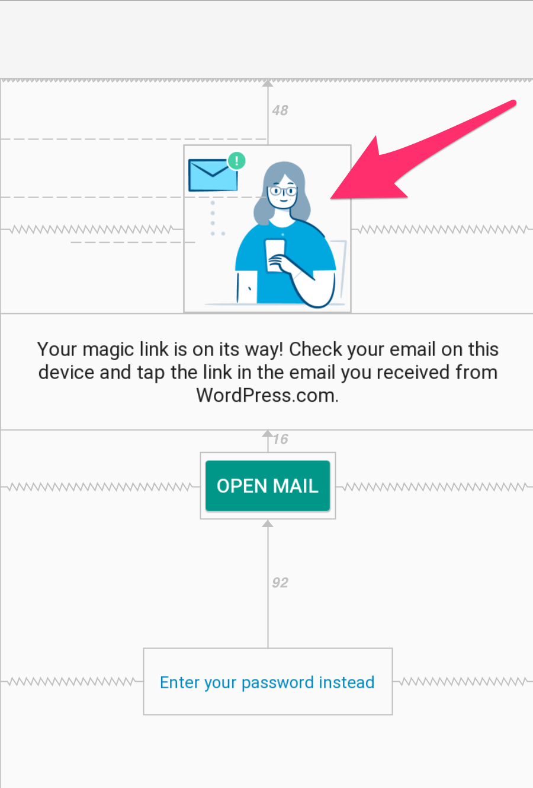

# TalkBack Guidelines

“Making applications accessible not only ensures equal access to the roughly 1 billion people in the world with disabilities but also benefits people without disabilities by allowing them to customize their experiences.” - [Google Accessibility] (https://www.google.com/accessibility/for-developers/)

### Table of Contents 

- [Governing Principles](#governing-principles)
- [Getting Started](#getting-started)
- [Guidelines](#guidelines)
   - [Basics](#basics)
	- [Simple Views](#simple-views)
	- [Complex Views](#complex-views)
- [Auditing](#auditing)
- [Further Reading](#further-reading)

##<a name="governing-principles"></a>Governing Accessibility Principles 
* Make the information on the screen as visible as possible. 
* Always design the size of controls and touch areas inclusive of all use cases.
* Provide as much support context and details for all views & actions. Images, buttons, lists and the actions they enable should have thorough, well-formatted descriptions that allow the accessibility APIs to deliver their intent seamlessly. 

	For more details visit [Make apps more accessible
](https://developer.android.com/guide/topics/ui/accessibility/apps.html).
	
## <a name="getting-started"></a>Getting Started

If you have never worked with TalkBack you can visit the TalkBack resources to get started.

- [Using TalkBack](using-talback.md)

## <a name="basics"></a>Basics

The accessibility framework within Android has several ways in which you can provide cues to TalkBack so it knows how it make it's announcement when a view becomes focused. 

* `contentDescription`  - Each view has this attribute that allows you to set meaningful and descriptive labels. If this is missing TalkBack might not be able to provide much value to the user. 
* `importantForAccessibility` - In cases where a view or layout might not have a need to be accessible this attribute can be set. It basically allows TalkBack to ignore views that have this property set to `yes` thus eliminating the need for a content description. 
* `hint` - For usability purposes, the text input control `EditText` has the hint attribute. If another view is providing the label then you can utilize the `labelFor` attribute. Below is an example.  

 ```
 <LinearLayout
    android:layout_width="match_parent"
    android:layout_height="match_parent"
    android:orientation="vertical">
    <TextView
        android:layout_width="match_parent"
        android:layout_height="wrap_content"
        android:text="@string/email_subject_label"
        android:labelFor="@id/email_subject" />
    <EditText
        android:id="@+id/email_subject"
        android:layout_width="wrap_content"
        android:layout_height="wrap_content" />
</LinearLayout>


## <a name="simple-views"></a> Simple Views


### General 
To make a view ready for accessibility these are the rules that should govern the content descriptions that are set. 

* Do not include the type of the control. TalkBack will automatically announce the description you have set and the type. 
* Ensure that each description is unique. This ensures that TalkBack is able to communicate different views of the same type to the user without causing any confusion. This is especially useful in list controls such as `ListView` or `RecyclerView` where a view template is being used for each row with similar controls. In such cases, each row should have unique content descriptions. 
* Like all strings, content descriptions should be localized for maximum support in all languages. 


### Activity titles
When an Activity comes to the foreground, TalkBack announces it’s title. When the activity has no title, TalkBack announces the name of the application which might confuse the user -> **_set a title to all visible activities_**, either in AndroidManifest or using Activity.setTitle() method.

### Images
Set contentDescription attribute to all ImageViews (null is a valid value).

Illustrative images and images with labels should have contentDescription set to null -> “android:contentDescription="@null" or have importantForAccessibility set to “no” -> “android:importantForAccessibility="no".



ImageButtons with labels should have contentDescription set to null. Setting importanceForAccessibility to “no” makes them unfocusable in the accessibility mode.


#### Touch Targets
Be sure to check for insufficient touch targets on a screen. An element that’s touch enabled should at least 48dp x 48dp. 

For views where you don’t want to modify the padding you can utilize the [TouchDelegate](https://developer.android.com/reference/android/view/TouchDelegate) functionality where you are able to get the current “Hit Rect) which is a rect with the current bounds and you are able to modify it to increase the touch area. 


### Grouping content
If users should treat a set of elements as a single unit of information, you can group these elements in a focusable container using `android:focusable=”true”` or a`ndroid:screenReaderFocusable` attribute to `true` in API 28 and above.  


In cases like these, it's important that the descriptions of the elements are kept short since they all will be announced in a single utterance. 


### Custom Views
Make sure that custom views are accessible with both Switch Access and TalkBack. Consider implementing accessibility functionality for them using ExploreByTouchHelper.
